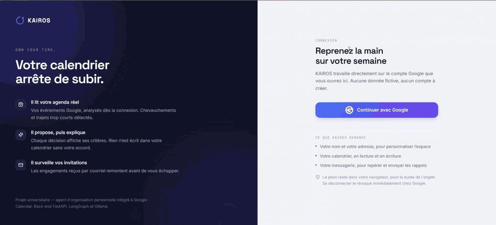

# KAIROS — AI Personal Organization Agent

**KAIROS** is a local-first AI personal organization assistant that helps users understand, organize, and act on their real schedule through natural language.

It combines a **React + TypeScript** frontend, a **FastAPI + LangGraph** backend, a local **Ollama / Llama 3.2 3B** model, and integrations with **Google Calendar** and **Gmail**.

> **Own your time.** KAIROS proposes, the user decides, and the agent explains.

---

## Demo

### Animated Demo

Place your GIF here:

```text
assets/demo.gif
```

It will be displayed directly in the README:

<p align="center">
  
</p>


## Overview

KAIROS is an AI-powered personal organization agent built around the user's real Google Calendar.

The application can analyze a calendar, answer natural-language questions, detect scheduling issues, identify free time, prepare calendar actions, import candidate events from documents, and manage Gmail-based reminders.

A core design principle is the separation between:

- **Deterministic schedule calculations** performed in Python
- **Language understanding and presentation** performed by the local LLM
- **Real Google Calendar actions** performed only after explicit user confirmation

This prevents the language model from inventing numerical schedule facts or silently modifying the user's calendar.

---

## Project Context

*Kairos* is the Greek concept of the **right or opportune moment**, in contrast with *Chronos*, chronological time.

The project explores the following question:

> How can an AI agent help users understand and manage their real schedule while preserving privacy, explainability, and user control?

KAIROS was developed as a university project around the topic of an **AI Personal Organization Agent**.

---

## Problem

Calendar applications can show events, but users often need more than a visual agenda.

Typical questions include:

- What does my day look like?
- Do I have overlapping events?
- Do I have enough time to travel between appointments?
- When am I free?
- Can I create an event at a given time?
- Which event should be deleted when several have similar names?
- Can I import a schedule from a PDF or image?
- Can I receive reminders by email?

An AI assistant for real calendars must also avoid two major problems:

- hallucinating factual schedule information
- performing sensitive actions without user approval

---

## Solution

KAIROS follows four main principles:

1. **Google Calendar remains the source of truth.**
2. **Python computes factual schedule information** such as durations, overlaps, travel gaps, and free slots.
3. **The local LLM interprets requests and presents established facts** in natural language.
4. **Calendar-changing actions are proposals first** and are executed only after explicit confirmation in the frontend.

---

## Key Features

### AI Assistant

- Natural-language calendar questions
- Day, week, month, and custom-period analysis
- Intent classification with LangGraph
- Local LLM execution through Ollama
- Session-based conversational memory
- Degraded mode when Ollama is unavailable
- French natural-language responses

### Google Calendar

- Read real Google Calendar events
- Create events after user confirmation
- Delete events after user confirmation
- Move events from the frontend
- Detect overlapping events
- Detect insufficient travel time
- Find available time slots
- Protect against ambiguous deletion requests
- Time-zone-aware scheduling

### Gmail & Reminders

- Google OAuth2 integration
- Gmail reminder delivery
- Reminder scheduling with APScheduler
- Local reminder persistence
- Weekly summary preferences

### Document Import

- Analyze text-based PDFs
- Extract PDF text with `pypdf`
- Analyze images or scanned PDFs with a compatible multimodal Ollama model
- Return candidate events for verification
- Never create imported events automatically

### User Experience

- Today page
- Calendar page
- AI Assistant page
- Notifications page
- Integrations page
- Settings page
- Command menu
- Event creation dialog
- Event import dialog
- Conflict explanations
- Responsive navigation
- Light / dark interface support

---

## Human-in-the-Loop Calendar Actions

KAIROS separates **proposal** from **execution**:

```text
User Request
    ↓
Intent Detection
    ↓
Schedule Analysis
    ↓
Action Proposal
    ↓
Conflict / Ambiguity Validation
    ↓
User Confirmation
    ↓
Google Calendar Action
```

Two important rules are enforced:

- **A conflict blocks silent creation.** KAIROS warns the user and can propose another slot.
- **An ambiguous deletion deletes nothing.** The user must identify the intended event first.

---

## Agent Architecture

The LangGraph agent is organized around four main nodes:

```text
                     ┌──→ agir ─────────────────┐
                     │                          │
START → comprendre ──┤                          ├──→ END
                     │                          │
                     └──→ extraire → présenter ─┘
```

| Node | Responsibility |
|---|---|
| `comprendre` | Understand the user's intent and requested time period |
| `agir` | Prepare calendar creation or deletion proposals |
| `extraire` | Compute factual schedule information deterministically |
| `présenter` | Turn established facts into a natural-language response |

The important rule is simple:

> The LLM does not calculate the calendar facts. Python does.

---

## Data Flow

```text
Google Calendar / Gmail
          ↓
   React Frontend
          ↓
Events + User Request
          ↓
    FastAPI Backend
          ↓
      LangGraph
     ↙         ↘
Python Logic   Ollama LLM
     ↘         ↙
   Structured Reply
          ↓
   React Interface
          ↓
Explicit User Confirmation
          ↓
 Google Calendar Action
```

The Google access token remains in the browser. The backend receives calendar events already read by the frontend and reasons over them.

---

## Conversation Memory

KAIROS keeps lightweight conversational context per browser tab.

The frontend generates a session identifier stored in `sessionStorage`, and the backend stores:

- recent user messages
- recent assistant summaries
- recent calendar context
- incomplete creation requests
- ambiguous deletion requests

This allows follow-up messages such as clarifications to reuse the previous context.

---

## Time-Zone Handling

The browser sends its IANA time zone with every agent request.

The backend converts timestamps into the user's local zone before reasoning about:

- natural-language hours
- day boundaries
- scheduling conflicts
- event creation
- available time slots

On Windows, the backend uses the `tzdata` package when the operating system does not provide the IANA time-zone database.

---

## Tech Stack

### Frontend

- React 19
- TypeScript
- Vite 6
- Tailwind CSS 4
- React Router
- TanStack Query
- Zustand
- React Hook Form
- Zod
- Framer Motion
- Radix UI
- dnd-kit
- Lucide React
- Sonner
- date-fns

### Backend / Agent

- Python
- FastAPI
- Uvicorn
- LangGraph
- Pydantic
- Pydantic Settings
- HTTPX
- APScheduler
- pypdf

### AI

- Ollama
- Llama 3.2 3B by default
- Optional multimodal Ollama models for images / scanned PDFs

### Integrations

- Google Calendar API
- Gmail API
- Google OAuth2

### DevOps

- Docker
- Docker Compose
- Nginx
- Optional NVIDIA GPU acceleration

---

## Project Structure

```text
kairos_Agent/
│
├── README.md
├── .gitignore
├── .env.example
├── docker-compose.yml
├── docker-compose.gpu.yml
├── DOCKER.md
│
├── assets/
│   ├── demo.gif
│   └── demo.mp4
│
├── kairos/
│   ├── src/
│   │   ├── app/
│   │   ├── components/
│   │   │   ├── assistant/
│   │   │   ├── calendar/
│   │   │   ├── command-menu/
│   │   │   ├── conflicts/
│   │   │   ├── events/
│   │   │   ├── integrations/
│   │   │   ├── layout/
│   │   │   ├── notifications/
│   │   │   └── ui/
│   │   ├── pages/
│   │   ├── services/
│   │   │   └── google/
│   │   └── store/
│   ├── .env.example
│   ├── Dockerfile
│   ├── nginx.conf
│   ├── package.json
│   └── vite.config.ts
│
└── kairos-agent/
    ├── app/
    │   ├── agent/
    │   │   ├── nodes/
    │   │   ├── graph.py
    │   │   ├── horaire.py
    │   │   ├── periode.py
    │   │   └── fuseau.py
    │   ├── bench/
    │   ├── llm/
    │   ├── routers/
    │   ├── services/
    │   ├── config.py
    │   ├── main.py
    │   └── schemas.py
    ├── tests/
    ├── .env.example
    ├── Dockerfile
    └── requirements.txt
```

---

## Requirements

### Local Development

- Node.js
- npm
- Python 3.11 recommended
- Ollama
- Google Cloud project
- Google Calendar API enabled

For Gmail reminders:

- Gmail API enabled
- Google OAuth Web Application credentials

Optional:

- Docker Desktop
- NVIDIA GPU support
- A multimodal Ollama model for image / scanned-PDF analysis

---

# Installation — Local Development

## 1. Clone the Repository

```bash
git clone https://github.com/arefbakali/kairos_Agent.git
cd kairos_Agent
```

---

## 2. Install Ollama

Install Ollama and download the default model:

```bash
ollama pull llama3.2:3b
```

Ollama normally runs on:

```text
http://localhost:11434
```

---

## 3. Backend Setup

Open the backend directory:

```bash
cd kairos-agent
```

Create the Python virtual environment:

```bash
python -m venv .venv
```

Activate it on Windows PowerShell:

```powershell
.\.venv\Scripts\Activate.ps1
```

On macOS / Linux:

```bash
source .venv/bin/activate
```

Install dependencies:

```bash
pip install -r requirements.txt
```

Create the environment file:

```powershell
Copy-Item .env.example .env
```

On macOS / Linux:

```bash
cp .env.example .env
```

Default configuration:

```env
LLM_PROVIDER=ollama
LLM_MODEL=llama3.2:3b
OLLAMA_BASE_URL=http://localhost:11434
FRONTEND_ORIGIN=http://localhost:5173
LLM_TIMEOUT=120
```

Optional Gmail reminder configuration:

```env
GOOGLE_CLIENT_ID=
GOOGLE_CLIENT_SECRET=
GOOGLE_REDIRECT_URI=http://localhost:8000/api/reminders/callback
```

Run the backend:

```bash
uvicorn app.main:app --reload
```

Backend:

```text
http://localhost:8000
```

Interactive API documentation:

```text
http://localhost:8000/docs
```

---

## 4. Frontend Setup

Open a second terminal:

```bash
cd kairos
npm install
```

Create the frontend environment file:

```powershell
Copy-Item .env.example .env
```

Configure:

```env
VITE_GOOGLE_CLIENT_ID=your_google_web_client_id
VITE_AGENT_API_URL=http://localhost:8000
```

Start the frontend:

```bash
npm run dev
```

Frontend:

```text
http://localhost:5173
```

---

## Google OAuth Configuration

Create a Google Cloud project and enable:

- Google Calendar API
- Gmail API if using email reminders

Create an OAuth **Web Application** client.

For local frontend authentication, authorize:

```text
http://localhost:5173
```

For Gmail reminder OAuth, configure the backend redirect URI:

```text
http://localhost:8000/api/reminders/callback
```

> Never commit real Google credentials or `.env` files to GitHub.

---

# Docker

KAIROS includes a complete Docker Compose stack.

## Services

| Service | Role | Host Port |
|---|---|---:|
| `ollama` | Local LLM server | Internal only |
| `ollama-pull` | Downloads the configured model if absent | — |
| `backend` | FastAPI + LangGraph | `8000` |
| `frontend` | Nginx + React build | `5173` |

Startup order:

```text
ollama
   ↓
ollama-pull
   ↓
backend
   ↓
frontend
```

---

## Docker Configuration

At the repository root:

```powershell
Copy-Item .env.example .env
```

Typical root configuration:

```env
LLM_MODEL=llama3.2:3b
OLLAMA_VERSION=0.32.1
OLLAMA_BASE_URL=http://ollama:11434

FRONTEND_PORT=5173
BACKEND_PORT=8000

VITE_GOOGLE_CLIENT_ID=
VITE_AGENT_API_URL=http://localhost:8000
```

Backend secrets remain in:

```text
kairos-agent/.env
```

---

## Start with Docker

```bash
docker compose up -d --build
```

Check service status:

```bash
docker compose ps
```

Follow all logs:

```bash
docker compose logs -f
```

Backend logs:

```bash
docker compose logs -f backend
```

Model download logs:

```bash
docker compose logs ollama-pull
```

Stop containers:

```bash
docker compose stop
```

Remove containers while keeping volumes:

```bash
docker compose down
```

---

## NVIDIA GPU Support

If your Docker environment supports NVIDIA GPUs:

```bash
docker compose -f docker-compose.yml -f docker-compose.gpu.yml up -d
```

---

## Persistent Docker Data

Ollama model files are persisted in:

```text
Docker volume: kairos-ollama-models
```

Backend reminder state is persisted in:

```text
kairos-agent/data/
```

This backend data can contain OAuth-related runtime state and must **not** be committed to GitHub.

---

## Main API Endpoints

### Agent

```text
POST /api/agent/present
POST /api/agent/present-day
POST /api/agent/chat
GET  /api/agent/health
```

### Document Import

```text
POST /api/import/analyze
GET  /api/import/capabilities
```

### Reminders

The backend exposes routes for Gmail OAuth, reminder synchronization, reminder cancellation, status, and weekly-summary preferences.

---

## Document Import

### Text-Based PDF

```text
PDF
 ↓
pypdf text extraction
 ↓
Ollama
 ↓
Candidate events
 ↓
User verification
```

### Images / Scanned PDFs

A compatible multimodal Ollama model is required.

The backend only analyzes the document and returns candidate events. The frontend asks the user to review and confirm before creating Google Calendar events.

---

## Degraded Mode

If Ollama is unavailable, KAIROS can still preserve deterministic facts calculated by Python.

The interface can report that the local model is unavailable instead of fabricating a result.

---

## Privacy & Security

KAIROS follows a local-first architecture:

- The LLM runs locally through Ollama.
- Calendar calculations are performed deterministically in Python.
- The frontend keeps the Google access token in the browser.
- Calendar changes require explicit confirmation.
- Imported events are reviewed before creation.
- `.env` files must never be committed.
- Gmail reminder state and OAuth-related runtime data must never be committed.
- Google Calendar and Gmail still communicate with Google's APIs because they are external services.

---

## Do Not Commit

The repository must exclude:

```text
.env
kairos/.env
kairos-agent/.env

venv/
.venv/
node_modules/
dist/

__pycache__/
*.pyc

kairos-agent/data/
```

Use the `.gitignore` provided with this repository.

---

## Limitations

- Google OAuth configuration is required for real Calendar integration.
- Gmail OAuth is required for email reminders.
- The default `llama3.2:3b` model is text-only.
- Images and scanned PDFs require a compatible multimodal Ollama model.
- Conversation memory is session-oriented and local to the backend process.
- Reminder state is currently stored locally.
- A production deployment requires HTTPS and additional security hardening.

---

## Future Improvements

- Persistent database-backed conversation memory
- Stronger multi-user isolation
- Database-backed reminder storage
- More automated testing
- CI/CD
- Production HTTPS deployment
- Additional multimodal models
- Advanced planning and prioritization
- Explainable scheduling recommendations
- Server-side Google authentication

---

## Academic Context

KAIROS was developed as a university project around:

**AI Personal Organization Agent**

The project combines:

- Agentic AI
- Local LLMs
- LangGraph
- Calendar reasoning
- Human-in-the-loop actions
- Google Calendar and Gmail
- Document understanding
- Full-stack development
- Docker deployment

---

## Contact

- **GitHub:** https://github.com/arefbakali
- **LinkedIn:** https://www.linkedin.com/in/aref-bak-ali/
- **Email:** aref.bak-ali@dauphine.eu
- **Portfolio:** https://portfolio-aref.vercel.app/

## Author

**Aref Bak Ali**  
AI, Data Science & Agentic AI Student  
Université Paris Dauphine-PSL

---

## Demo Files Reminder

Before publishing the repository, add:

```text
assets/demo.gif
assets/demo.mp4
```

The GIF will appear directly in the README.

The MP4 will be available through:

```markdown
🎥 **[Watch the full KAIROS demo](assets/demo.mp4)**
```
